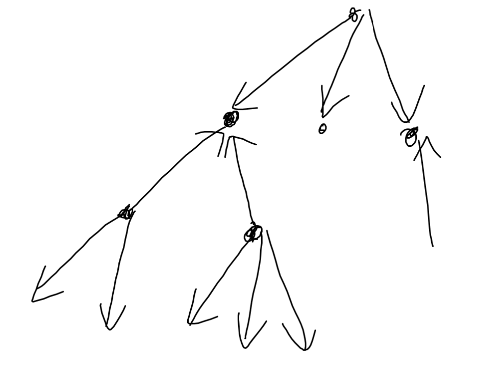

$u$-аас $v$-рүү ирмэг байдаг бол $(u,v)$ нь сайн хос байх ба $n-1$ ирмэгтэй тул сайн хосын тоо ядаж $n-1$ байна. Дараах байдлаар чиглэл өгвөл яг $n-1$ байна. Өөрөөр хэлбэл орой бүрийн хувьд бүх хөрш ирмэг нь  орсон эсвэл гарсан байна.

Иймд сайн хосын тоо $n-1$-ээс их байхын тулд ядаж нэг хөрш ирмэг нь гарсан ба ядаж нэг хөрш ирмэг нь орсон нэг орой байх ёстой. Харин тэрний оройн зэрэг нь 2-оос их байх юм бол сайн хосын тоо $n-1$ дээр нэмээд ядаж 2-оор ихэснэ. Тиймээс оройн зэрэг нь 2 байх орой олдохгүй бол NO ба олдвол тэр оройн нэг ирмэгийг нь орсон, нөгөөг нь гарсан, бусдыг нь дээрх байдлаар чиглүүлэхэд яг $n$ болно. 

**Time complexity: $O(n)$**\
[Submission](https://codeforces.com/contest/2112/submission/325739641)
