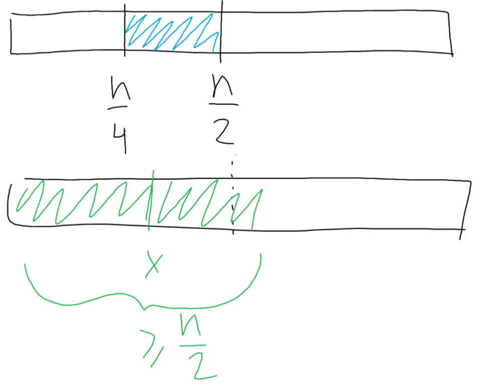

# Бодолт

Ямар нэг анхны тоог $c$-ийн эхлэлд нь аль болох олон байлгах гээд үзье. ($c_1=x,c_2=x,c_3=x,\dots$)  
2, 3-ыг үзэхээр яалт ч үгүй хол явж чадахгүй. $s_i=p_1+p_2+\dots+p_i$ гэе. 11-ийг үзвэл
* $11 \le s_1 \le 11$
* $21 \le s_2 \le 22$
* $31 \le s_3 \le 33$
* $41 \le s_4 \le 44$
* $51 \le s_5 \le 55$
* $61 \le s_6 \le 66$

байх ёстой гэдгээс $p_1=11,p_2=10,p_3=12$ болно. Үүнийг $p_4=9,p_5=13,p_6=8,p_7=14$ гэсэн зүй тогтлоор үргэлжлүүлбэл $c_i$-үүд нь 11 байгаад байгааг харж болно. Ерөнхий тохиолдолд:

$i$ | $p_i$ | $s_i$ | $c_i$  
------------- | ------------- | ------------- | -------------
$1$  | $x$ | $x$ | $\left\lceil \dfrac{x}{1} \right\rceil = x$
$2$  | $x-1$ | $2x-1$ | $\left\lceil \dfrac{2x-1}{2} \right\rceil = \left\lceil x-\dfrac{1}{2} \right\rceil = x$
$3$  | $x+1$ | $3x$ | $\left\lceil \dfrac{3x}{3} \right\rceil = x$
$4$  | $x-2$ | $4x-2$ | $\left\lceil \dfrac{4x-2}{4} \right\rceil = \left\lceil x-\dfrac{1}{2} \right\rceil = x$
$5$  | $x+2$ | $5x$ | $\left\lceil \dfrac{5x}{5} \right \rceil = x$
$6$  | $x-3$ | $6x-3$ | $\left\lceil \dfrac{6x-3}{6} \right\rceil = \left\lceil x-\dfrac{1}{2} \right\rceil = x$
$7$  | $x+3$ | $7x$ | $\left\lceil \dfrac{7x}{7} \right\rceil = x$

Иймд $c$-ийн эхний $1+2(x-1)$ утгыг $x$ байлгаж чадна.  
$1$-ээс их бүхэл $m$-ийн хувьд $m<p<2m$ байх $p$ анхны тоо олддог болохоор цэнхэр хэсэгт анхны тоо байгаа ($n/4, n/2$ бүхэл биш ч гэсэн ер нь гайгүй, олдохгүй бол баруун талд нь ойрхон олдоно).  Тэр тоог сонговол ядаж $n/2$ хавьцаа хүртэл $i$-ийн хувьд $c_i=x$ байлгаж чадна.

[Submission](https://codeforces.com/contest/2089/submission/312041798)
