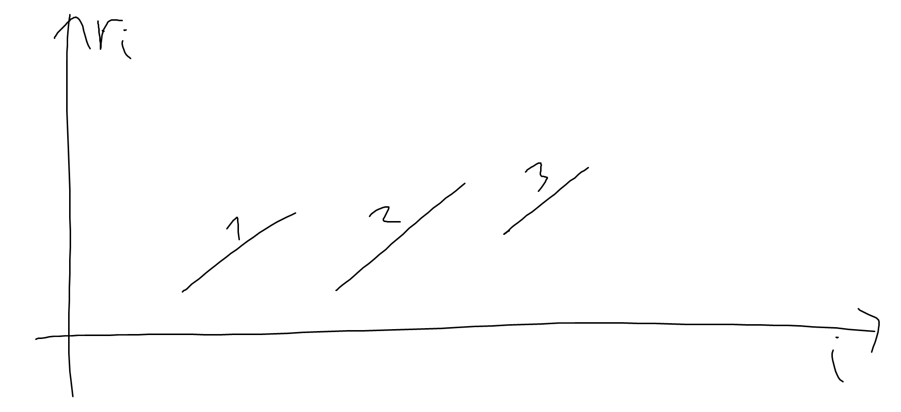
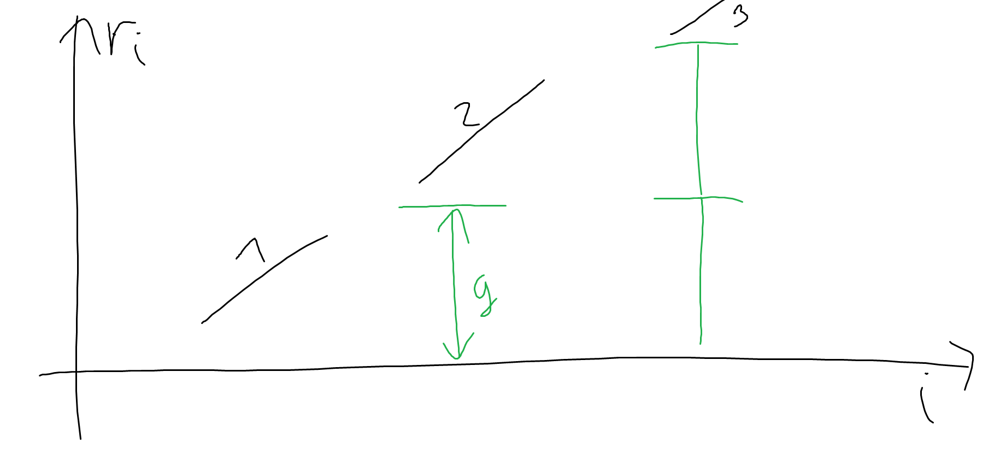

$g=gcd(k,m)$ гэвэл нэг үйлдлээр $a_i$-ийн $g$-д хуваахад өгөх үлдэгдэл өөрчлөгдөхгүй ба $a_i$-г $0 \le a_i+tg < m$ ($t$ нь бүхэл тоо) байх дурын тоонд ямар нэг тооны үйлдлийн дараа хувиргаж чадна.

$a$-г буурахгүй болгохын тулд $a_1$-г чадахаараа аль болох бага болгоод, $a_2$-г $a_1$-ээс багагүй аль болох бага болгох гэх мэтчилэн явах нь зүйтэй. $r_i=a_i \bmod g$  гээд $r$-г үл буурах хэсгүүдэд хуваахад дараах байдалтай болсон гэвэл: (Жишээ нь: $r=[2,3,5,0,3,1,7]$ байвал $[2,3,5], [0, 3], [1, 7]$ хэсгүүдэд хуваана)

1-р хэсгийн тоонууд аль хэдийн бидний хүссэн байдлаар ($a_1$ аль болох бага, $a_2$ нь $a_1$-ээс багагүй аль болох бага...) байх ба 2-р хэсгийн тоонууд дээр яг 1 удаа, 3-р хэсгийн тоонууд дээр яг 2 удаа үйлдэл хийх нь зохистой.

Иймд $r_n$ нь $d$-р хэсэгт орсон гэвэл $r_n+(d-1)g<m$ байвал л  хариу нь YES байна. $d$ нь $a_i>a_{i+1}$ байх $i$-ийн тоо(*) ноос олдоно.

$g$ нь $m$-ийн хуваагч байх тул $g$-ийн боломжит бүх утгын хувьд харгалзах $r$ болон (*)-г хадгалаад явбал $O(d(m))$ хугацаанд шинэчлэлт хийж, $O(\log m)$ хугацаанд асуултанд хариулж чадна. Мөн анх $O(M\log M)$ хугацаанд бүх $m$-ийн хувьд хуваагчдыг нь олно. Энд $M$ нь $m$-ийн хамгийн их утга ба $d(m)$ нь $m$-ийн хуваагчдын тоо. 

[Submission](https://codeforces.com/contest/2123/submission/326886626)
