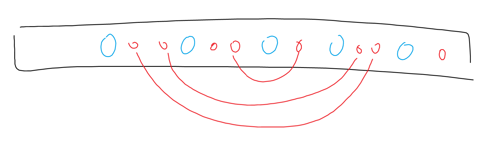

Эрэмбэлэгдсэн $a$-г $`a'`$, мөн $`a'_k`$-г $x$ гэе. $x$-ээс бага тоонуудыг устгаж чадахгүй тул тэдгээр нь заавал үлдэх ёстой. Тийм $t$ ширхэг тоо байдаг гэвэл бас ядаж $k-1-t$ ширхэг $x$ үлдэх ёстой. Харин $x$-ээс их тоонууд эцсийн дараалалд үлддэг байсан ч тэдгээрийг устгасан ч (хэрэв чаддаг бол) палиндром хэвээр үлдэнэ. Үнэндээ $x$-ээс их тоонуудыг бүгдийг нь устгаж чадна: хамгийн их тоог нь агуулсан $k$ урттай дэд хэсгийг сонгоод тэр их тоогоо устгаад явна.

Зөвхөн $x$-ээс бага тоонууд дангаараа палиндром үүсгэх ёстой ба тэдгээр дээр нэмээд ядаж $k-1-t$ ширхэг $x$-ийг палиндром байхаар сонгож чадвал YES, үгүй бол NO. $x$-үүдээ сонгохдоо доорх зурагт (цэнхэрүүд нь $x$-ээс бага тоонууд, улаанууд нь $x$-үүд) харагдаж байгаа шиг улаануудаа цэнхэрүүдтэй хамааралтай байрлалаар нь хослуулна.

**Time complexity:** $O(n\log n)$\
[Submission](https://codeforces.com/contest/2124/submission/327768449)